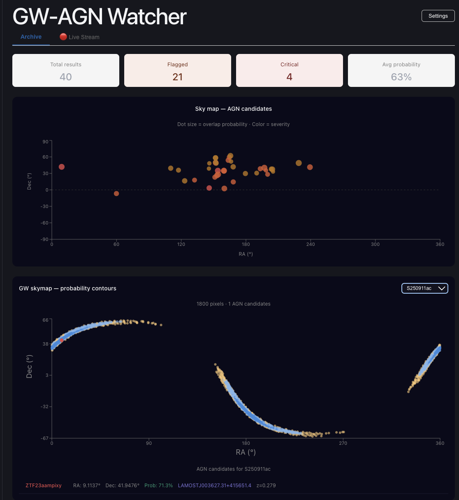
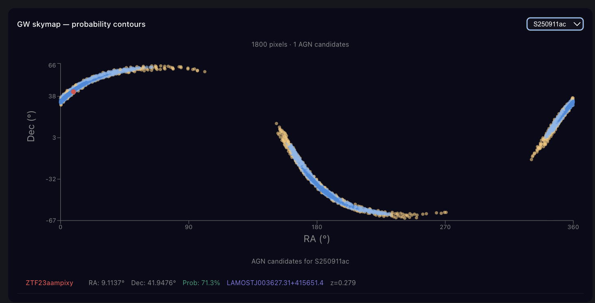
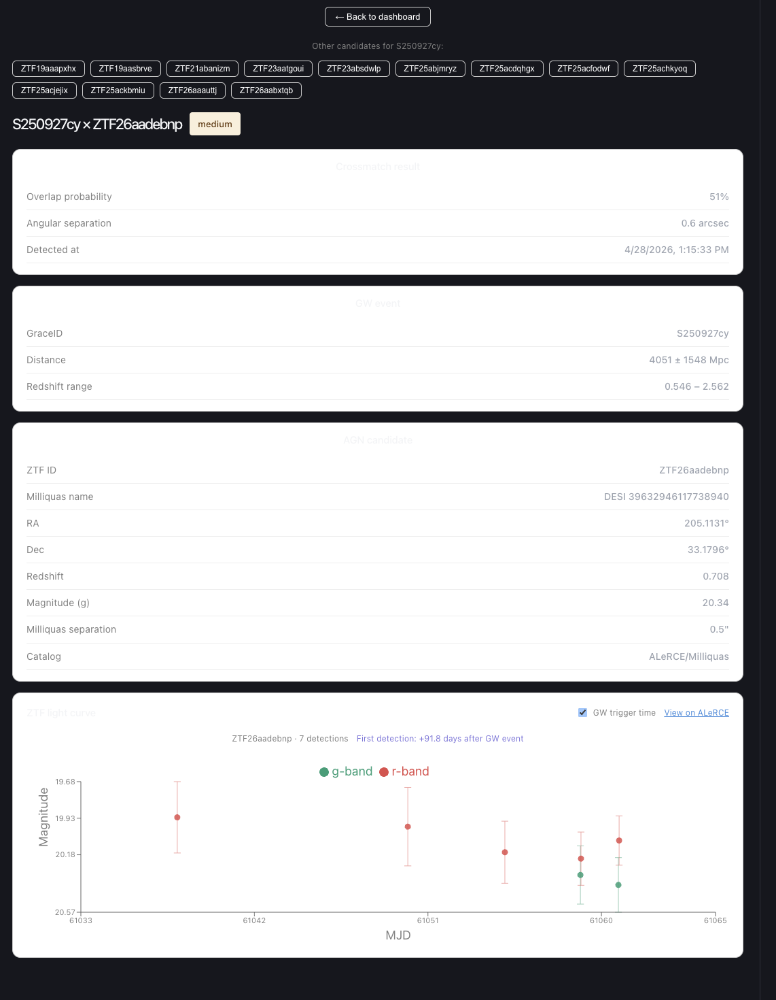

# GW-AGN Watcher Dashboard

> Real-time dashboard for gravitational wave follow-up — crossmatching LIGO/Virgo/KAGRA events with AGN candidates from ZTF/ALeRCE.

[](https://gw-agn-dashboard.vercel.app)
[](LICENSE)
[](https://www.typescriptlang.org/)
[](https://github.com/nasa-gcn/gcn.nasa.gov/pull/3579)

---

## Science Motivation

When LIGO/Virgo/KAGRA detects a gravitational wave event, one leading candidate source is a merger involving an AGN (Active Galactic Nucleus) — a supermassive black hole system that could host merging compact objects producing both gravitational wave and electromagnetic emission. Identifying these counterparts requires crossmatching GW sky localizations with real-time transient alert streams within hours of the GW trigger.

This tool automates that workflow end-to-end.

---

## Features

- 🗺️ **GW skymap overlay** with LIGO probability contours and event selector
- 🔭 **ZTF light curves** (g and r band) with GW trigger time marker
- 🧬 **AGN candidate ranking** by overlap probability, redshift, and light curve behavior
- 🔍 **Filtering** by severity, detection count, and angular separation
- 📋 **GraceDB metadata** integration with sibling candidate navigation
- ⚙️ **Pipeline configuration** panel

---
**Live demo:** https://gw-agn-dashboard.vercel.app

## Screenshots

### Main Dashboard


### GW Skymap with Probability Contours


### Candidate Detail View with ZTF Light Curve



This project has two components:

```
[Backend: Python pipeline on Google Colab]
        |
        | Outputs: final_candidates.csv, skymaps.csv
        | Auto-pushed to this repo via GitHub API
        ↓
[Frontend: React + TypeScript on Vercel]
        |
        | Reads CSVs from public/
        | Renders interactive dashboard
        ↓
[Live at gw-agn-dashboard.vercel.app]
```

---

## Tech Stack

| Layer | Tools |
|---|---|
| Pipeline | Python, `ligo.skymap`, `astropy`, ALeRCE API, Milliquas catalog |
| Alerts | GCN Kafka (`gcn-kafka`)|
| Backend | Colab |
| Frontend | React, TypeScript, Recharts, Vite |
| Deployment | Vercel (frontend), GitHub API (automated CSV push) |

---

## Quick Start

```bash
# Clone the repo
git clone https://github.com/Hemanthb1/gw-agn-dashboard.git
cd gw-agn-dashboard

# Install dependencies
npm install

# Start the dev server
npm run dev
```

The dashboard reads from `public/final_candidates.csv` and `public/skymaps.csv`.  
Replace these with outputs from the [GW_AGN_watcher](https://github.com/Hemanthb1/GW_AGN_watcher) pipeline.

---
## Running the Backend

The backend pipeline runs on Google Colab or locally. It uses the [GW_AGN_watcher](https://github.com/Hemanthb1/GW_AGN_watcher) Python package.

### Option 1 — Google Colab (recommended)

1. Open the pipeline notebook: [`example.ipynb`](https://github.com/Hemanthb1/GW_AGN_watcher/blob/main/example.ipynb)
2. Set your credentials in the Colab secrets panel:
   ```
   GITHUB_TOKEN=your_github_token
   GRACEDB_TOKEN=your_gracedb_token
   ALERCE_API_KEY=your_alerce_key   # optional
   ```
3. Run all cells — outputs are automatically pushed to `public/` in this repo


## Related

- 🐍 **Python pipeline:** [GW_AGN_watcher](https://github.com/Hemanthb1/GW_AGN_watcher)
- 🌐 **NASA GCN contribution:** [PR #3579](https://github.com/nasa-gcn/gcn.nasa.gov/pull/3579)

---

## Author

**Hemanth Bommireddy**  
PhD candidate, Universidad de Chile  
📧 hemanth.bommireddy195@gmail.com  
🔗 [ORCID](https://orcid.org/0009-0007-4271-6444) · [InspireHEP](https://inspirehep.net/authors/2902490)
